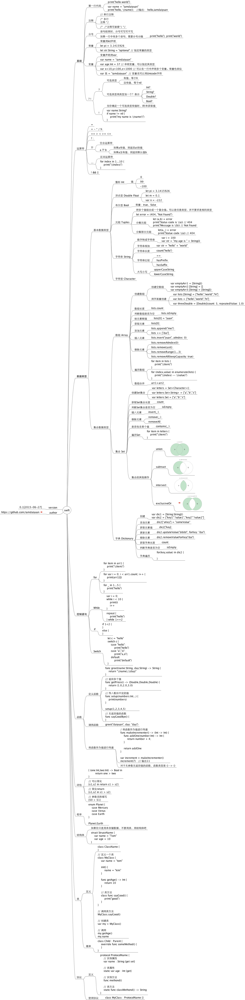

# 一张图学习swift

# 参考
1. [《The Swift Programming Language》中文版
](https://www.gitbook.com/book/numbbbbb/-the-swift-programming-language-/details)

2. [The Swift Programming Language](https://developer.apple.com/library/prerelease/ios/documentation/Swift/Conceptual/Swift_Programming_Language/index.html#//apple_ref/doc/uid/TP40014097)

3. [Using Swift with Cocoa and Objective-C](https://developer.apple.com/library/prerelease/ios/documentation/Swift/Conceptual/BuildingCocoaApps/index.html#//apple_ref/doc/uid/TP40014216)

4. [The Swift Programming Language中文手册](https://github.com/CocoaChina-editors/Welcome-to-Swift/blob/master/TheSwiftProgrammingLanguage%E4%B8%AD%E6%96%87%E6%89%8B%E5%86%8C.md)

5. [Using Swift with Cocoa and Objective-C中文手册](https://github.com/CocoaChina-editors/Welcome-to-Swift/blob/master/UsingSwiftwithCocoaandObjective-C%E4%B8%AD%E6%96%87%E6%89%8B%E5%86%8C.md)
